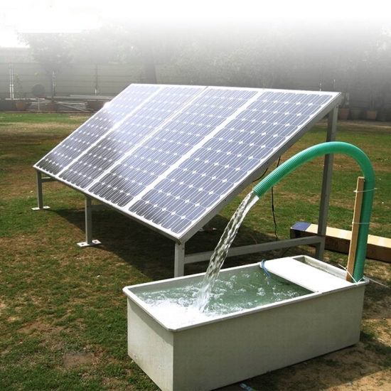
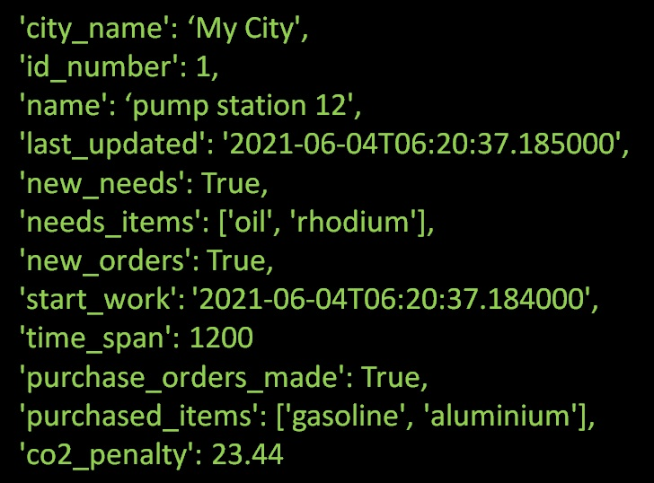
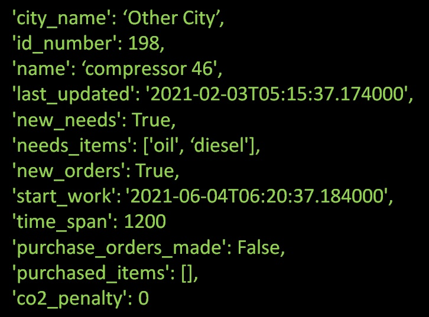
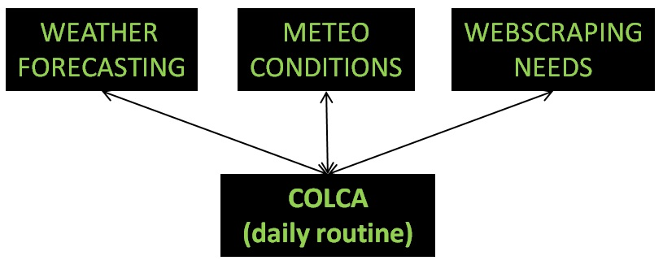
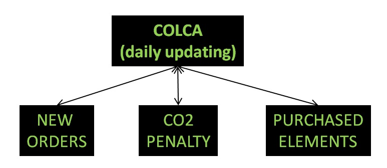

What is COLCA?
==============

Imagine that you have a machine, for instance a water pump. But this machine has something
different, it is powered through a solar panel. So, you have a solar water pump. Your goal
with this solar system is to have running water at a very low cost and with almost no CO2
emissions. Great!

Let's imagine now that this solar water pump needs to fill in a big tank with water in a day.
The water of this tank will be used later.

In order to have a very low energy cost and minimize CO2 emissions, you need to check the 
weather forecast daily to switch between using the solar energy or power the system with the
national grid. Not only that, you have to check if the oil levels of the pump are correct and
ckeck out for oil at good pricess evary time it must be changed.

Ok, you have only one machine, you can do it yourself.

But, if you have dozens of different machines, spread out there, different locations, different weather
conditions, different renewable power sources...different needs...how to handle that? How to perform a
cost control, or monitorize CO2 emissions and the price for that emissions?

There is a lot of work to do for going green!

What is the final purpose of this App?
--------------------------------------

COLCA manages all these things for you. It analyzes the weather forecasting for each 'machine', energy
prices, CO2 right prices and many other parameters to set up the optimal time window for each 'machine'
to work. For each 'machine', it automatically optimizes the renewal energy source use and minimizes the CO2 
emissions (and associated costs).

But not only that. It manages the purchase process of elements needed by the 'machine'. For instance, 
if the 'machine' needs industrial oil for working properly, it searches the web for a good price and
perform the purchase (this feature is not available yet).

Everything is under control. Saves money and time.

Why use COLCA?
--------------

It is time for going GREEN.

Optimize renewal sources is the best way to increase your profits. Avoiding CO2 emissions is 
another good way to increase your profits and make a great contribution to our future.

What is a 'process'?
--------------------

COLCA doesn`t use 'machine', we prefer to call it 'process'. Why? Because is more general and
adds abstraction about the things we are working with.

A 'process' could be our solar water pump, a wind-powered tool...anything that makes use of 
a renewal power source.

What kind of information has a 'process'?
-----------------------------------------

A 'process' can contain any kind of information. For example dates and time for working, lists of
elements that it needs for working properly, temperatures, pressures, any pyshical measurement you
want to manage.

An example could be the following:

Tell me about how it works...
-----------------------------

You are the owner of a company and you want to apply COLCA to some 'processes' that are now
powered througn windmills installed nearby your production plant.

You pick, for instance one 'process' with this information profile:

This 'process' is inside COLCA. Everyday COLCA is executed automatically.

For each 'process' COLCA checks the weather forecast, meteo conditions, inspect websites for
purchasing elements (if it is needed) at the best possible price, and evaluates CO2 emissions.

After all this work, COLCA updates the status of each 'process', giving new orders to the
'process' and with calculation of the CO2 emissions and its costs (penalty).

Later any process can make a consult at any moment to COLCA to update its status

COMPLETAR ESTA PARTE CON LA INFORMACION DE LOS RESULTADOS

